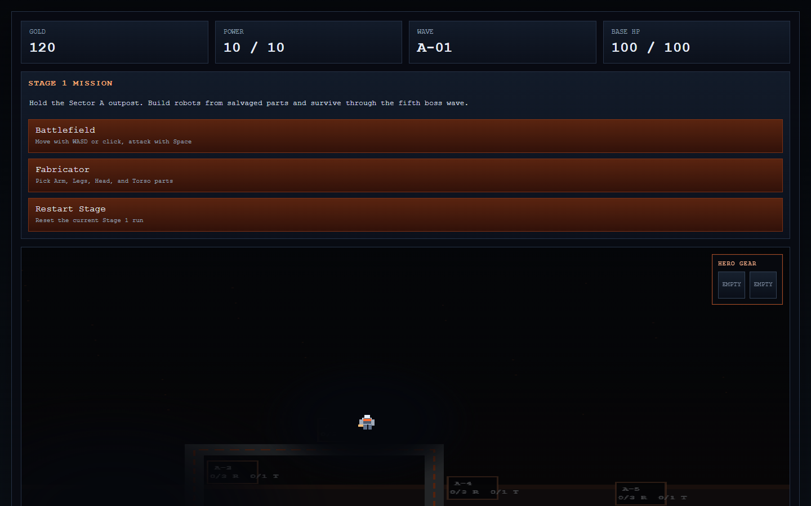
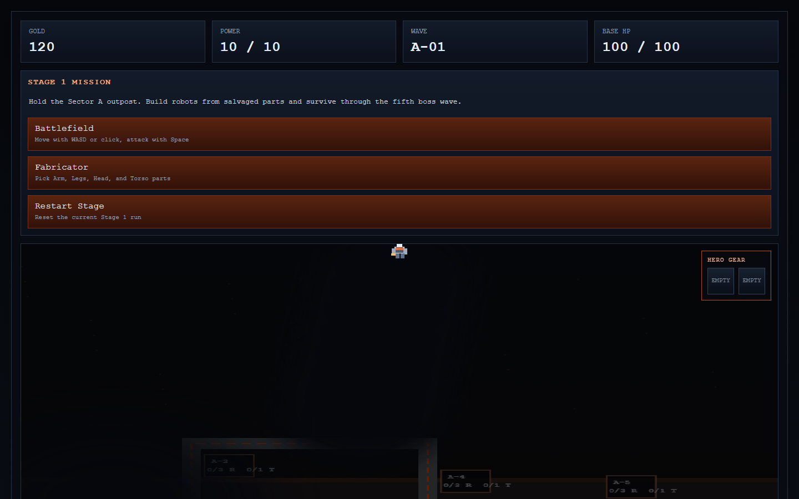

# Iron Frontier / Legion

> **TL;DR (EN):** A browser-game prototype testing whether an AI coding agent could assemble a component-based action RPG and base-defense loop.
> What worked: movement, combat, drops, part assembly, and base-defense systems.
> What still needs human judgment: system integration, balance, asset scope, and genre fit for AI-assisted prototyping. (as of 2026-04, using Codex)

### 2026-04 시점 화면

나중에 같은 아이디어를 다시 만들면 이 섹션 아래에 재시도 화면을 추가해, 당시 AI 도구가 어디까지 달라졌는지 비교합니다.

## 무엇을 확인하려고 만들었는가

`Legion`은 레포 이름이고, 정리용 게임 이름은 `Iron Frontier`입니다.

목표는 적을 처치해 부품을 얻고, 그 부품을 조합해 유닛을 만들고, 탐험과 파밍과 기지 방어를 이어가는 웹게임 프로토타입이었습니다. 참고 감각은 `Necrosmith`처럼 완성된 캐릭터를 고르는 것이 아니라, 머리/몸통/팔/다리 같은 부품을 조합해 새로운 유닛을 만드는 쪽에 가까웠습니다.

실행: `index.html`을 브라우저로 열면 실행됩니다.

## 실제로 작동한 것

- 플레이어 이동
- 적과의 전투
- 드랍과 부품
- 일부 부품 조합 흐름
- 기지 방어 구조
- 맵/시야와 진행 구조의 초안
- HTML/Canvas 기반 빠른 반복

이 실험에서 확인한 것은 AI coding agent가 여러 시스템이 들어간 브라우저 게임의 뼈대를 빠르게 만들 수 있다는 점입니다. 이동, 전투, 드랍, 조합, 방어처럼 기능 단위로는 많은 요소가 짧은 시간 안에 들어갔습니다.

## 부족했던 것

(2026-04, Codex 기준) 어려웠던 것은 기능을 하나씩 넣는 일이 아니라, 그 기능들이 안정적으로 맞물리게 하는 일이었습니다.

부품 조합형 게임은 처음 생각보다 에셋 요구량도 큽니다. 머리, 몸통, 팔, 다리, 무기, 피격 상태, 공격 모션이 따로 있어야 하고, 조합 후에도 자연스럽게 보여야 합니다. 이 에셋 체계가 없으면 기능은 있어도 하나의 게임처럼 느껴지기 어렵습니다.

결과적으로 복합 시스템의 뼈대는 만들 수 있었지만, 안정성, 분위기, 조작감, 에셋 일관성까지는 충분히 도달하지 못했습니다.

## 재시도 시 비교할 포인트

- 부품 조합 구조를 유지할지, 에셋 요구량이 낮은 장르로 바꿀지
- 조합 가능한 부품 수를 줄이고 규격을 먼저 정의하는 방식
- HTML/Canvas 대신 Godot/Unity 같은 엔진 활용 가능성
- 기능 목록보다 핵심 재미와 에셋 부담을 먼저 평가하는 방식
- 현재 2026-04 버전과 이후 AI coding agent 기반 재시도 버전 비교

## 관련 기록

이 프로젝트는 [AI Game Prototyping Experiments](https://github.com/rep87/ai-game-prototyping-experiments)의 일부입니다.

현재 레포는 완성작이 아니라 AI 게임 제작 실험 기록입니다.
